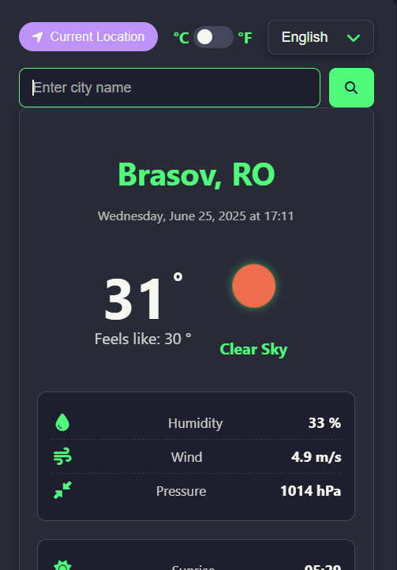

Aplicația Vremea
O aplicație web modernă pentru a verifica condițiile meteo actuale și prognoza pe termen scurt, cu suport pentru mai multe limbi și teme vizuale.

Descriere
Această aplicație meteo intuitivă permite utilizatorilor să obțină informații detaliate despre vreme pentru orice oraș din lume, folosind numele orașului sau locația lor curentă. Este construită modular, asigurând o mentenabilitate ușoară și o scalabilitate crescută.

Funcționalități
Căutare după oraș: Introduceți numele oricărui oraș pentru a obține date meteo.

Locație curentă: Utilizați geolocalizarea browserului sau locația bazată pe IP pentru a afișa vremea locală.

Unități de temperatură: Comutați între unitățile Celsius (°C) și Fahrenheit (°F).

Căutări recente: Salvează și afișează o listă de căutări recente pentru acces rapid.

Vizualizare interval de temperatură: Un indicator vizual al temperaturii curente în raport cu temperaturile minime și maxime din prognoză.

Detalii meteo complete: Afișează umiditatea, viteza vântului, presiunea, răsăritul și apusul soarelui.

Suport pentru mai multe limbi (i18n): Schimbați limba interfeței (Română, Engleză).

Teme vizuale diverse: Aplicația suportă multiple teme CSS (light, dark, dark neon, modern light, playful), fiecare oferind o experiență vizuală unică.

Responsive Design: Interfață adaptabilă pentru dispozitive mobile, tabletă și desktop.

Încărcare din URL: Aplicația poate încărca automat vremea pentru un oraș specificat ca parametru în URL (ex: index.html?city=Bucuresti).

Instalare și Rulare Locală
Pentru a rula aplicația local, urmați acești pași:

Clonați depozitul:

git clone https://github.com/Alexandru2984/anotherGo_at_weatherApp_js

cd anotherGo_at_weatherApp_js

Obțineți o cheie API OpenWeatherMap:

Mergeți pe OpenWeatherMap.org și creați-vă un cont.

Generați o cheie API (gratuită).

Configurați cheia API:

Deschideți fișierul scripts/config.js.

Înlocuiți "YOUR_OPENWEATHER_API_KEY" cu cheia API obținută de la OpenWeatherMap.

// scripts/config.js
export const OPENWEATHER_API_KEY = "CHEIA_TA_API_OPENWEATHERMAP";

Rulați serverul local:
Această aplicație este o aplicație web statică. O puteți rula deschizând direct fișierul index.html în browser, dar pentru a beneficia de toate funcționalitățile (precum cererile API cross-origin și geolocalizarea), este recomandat să folosiți un server local:

Cu Live Server (VS Code Extension):

Instalați extensia "Live Server" în VS Code.

Deschideți folderul rădăcină al proiectului în VS Code.

Faceți clic dreapta pe index.html și selectați "Open with Live Server" sau faceți clic pe butonul "Go Live" din bara de jos a VS Code.

Aplicația va fi accesibilă la http://127.0.0.1:5500/ sau http://localhost:5500/.

Structura Proiectului
Proiectul este organizat într-o structură modulară pentru o mai bună separare a preocupărilor și mentenabilitate:

.
├── index.html                  # Fișierul HTML principal al aplicației
├── styles/                     # Conține fișierele CSS pentru stilizare
│   └── styles.css              # Fișierul CSS principal al temei curente
└── scripts/                    # Conține toate fișierele JavaScript modularizate
    ├── app.js                  # Logica principală a aplicației, inițializare, event listeners
    ├── config.js               # Constante de configurare (chei API, URL-uri)
    ├── api.js                  # Gestionarea apelurilor către API-urile externe
    ├── ui.js                   # Funcții pentru manipularea interfeței utilizatorului și traduceri
    └── utils.js                # Funcții utilitare generale (ex: geolocalizare)

Tehnologii Folosite
HTML5: Structura paginii web.

CSS3: Stilizarea și aspectul aplicației, cu suport pentru variabile CSS (custom properties).

JavaScript (ES6+): Logica aplicației, manipularea DOM-ului, gestionarea API-urilor.

Font Awesome: Pentru iconițe.

API-uri
OpenWeatherMap API: Furnizează date meteo curente și prognoze.

IP-API: Utilizat ca metodă de rezervă pentru a obține locația utilizatorului pe baza adresei IP.

Planuri de Viitor
Iată câteva idei și direcții de dezvoltare viitoare pentru aplicație:

Securizarea Cheii API: Implementarea comunicării cu un server Python backend pentru a stoca și a gestiona cheia API OpenWeatherMap într-un mod sigur, evitând expunerea acesteia în codul frontend.

Prognoză Extinsă: Adăugarea suportului pentru prognoza meteo pe termen mai lung (de exemplu, 7 sau 14 zile).

Notificări Meteo: Funcționalitatea de a primi notificări pentru schimbări semnificative de vreme sau avertizări.

Grafice și Vizualizări Avansate: Integrarea de grafice pentru a vizualiza tendințele de temperatură, umiditate sau vânt pe parcursul zilei/săptămânii.

Personalizare Temă: Opțiuni extinse pentru utilizator de a personaliza culorile sau de a crea teme proprii.

Autentificare Utilizator: Posibilitatea de a crea conturi de utilizator pentru a salva orașele favorite sau setările personalizate.

Contribuții
Contribuțiile sunt binevenite! Dacă doriți să contribuiți, vă rugăm să urmați pașii standard Git:

Fork depozitul.

Creați o ramură nouă (git checkout -b feature/nume-functie).

Efectuați modificările și comiteți-le (git commit -m 'Adaugă o nouă funcție').

Împingeți modificările în ramura voastră (git push origin feature/nume-functie).

Deschideți un Pull Request.

Licență
Acest proiect este licențiat sub licența MIT (sau specificați licența pe care o folosiți).

Contact
Pentru întrebări sau feedback, mă puteți contacta la:

Email: alex_mihai984@yahoo.com

GitHub: github.com/Alexandru2984