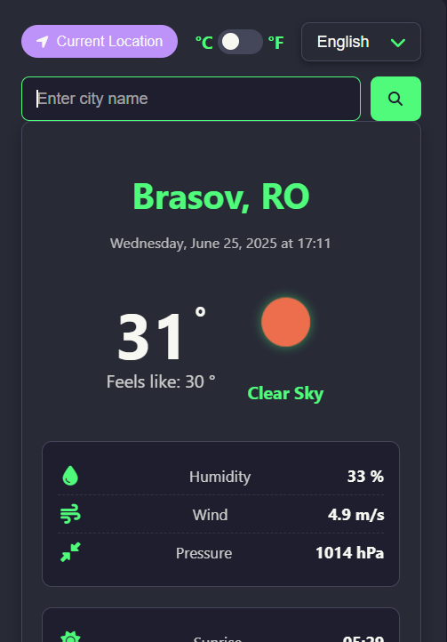

# Aplicația Vremea

O aplicație web modernă pentru a verifica condițiile meteo actuale și prognoza pe termen scurt, cu suport pentru mai multe limbi și teme vizuale.

---

## Descriere

Această aplicație meteo intuitivă permite utilizatorilor să obțină informații detaliate despre vreme pentru orice oraș din lume, folosind numele orașului sau locația lor curentă. Este construită modular, asigurând o mentenabilitate ușoară și o scalabilitate crescută.

---

## Funcționalități

- **Căutare după oraș:** Introduceți numele oricărui oraș pentru a obține date meteo.
- **Autocomplete orașe:** Sugestii de orașe prin proxy-ul OpenWeatherMap.
- **Locație curentă:** Utilizați geolocalizarea browserului sau locația bazată pe IP.
- **Unități de temperatură:** Comutați între Celsius (°C) și Fahrenheit (°F).
- **Căutări recente:** Salvează și afișează o listă de căutări recente pentru acces rapid.
- **Favorite locale:** Salvează orașe favorite în browser pentru acces rapid.
- **Share link:** Copiază un link direct către orașul afișat.
- **Prognoză pe 5 zile:** Afișează carduri zilnice cu temperatură, umiditate și vânt.
- **Grafic temperatură:** Vizualizează evoluția temperaturii pentru următoarele intervale.
- **Alerte meteo locale:** Evidențiază furtună, ploaie, ninsoare, vânt puternic și temperaturi extreme pe baza prognozei.
- **Calitatea aerului:** Afișează AQI, PM2.5, PM10 și O3 prin OpenWeather Air Pollution API.
- **Refresh rapid:** Reîncarcă datele pentru orașul sau coordonatele curente.
- **Vizualizare interval de temperatură:** Indicator vizual pentru temperaturile curente față de min/max prognozate.
- **Detalii meteo complete:** Umiditate, viteza vântului, presiune, răsărit și apus.
- **Suport i18n:** Schimbare limbă interfață (Română, Engleză).
- **Teme vizuale:** Light, dark, dark neon, modern light, playful.
- **Responsive design:** Interfață adaptabilă pentru mobil, tabletă și desktop.
- **Încărcare din URL:** Ex: `index.html?city=Bucuresti`.
- **PWA/offline shell:** Aplicația poate fi instalată și păstrează shell-ul în cache pentru încărcare offline.

---

## Captură de Ecran



---

## Instalare și Rulare Locală

Pentru a rula aplicația local, urmați acești pași:

### 1. Clonați depozitul

```bash
git clone https://github.com/Alexandru2984/anotherGo_at_weatherApp_js
cd anotherGo_at_weatherApp_js
```

### 2. Obțineți o cheie API OpenWeatherMap

- Mergeți pe [OpenWeatherMap.org](https://openweathermap.org) și creați un cont
- Generați o cheie API (gratuită)

### 3. Configurați cheia API pe server

Nu puneți cheia în JavaScript public. Copiați `.env.example` în `.env` și completați:

```bash
cp .env.example .env
nano .env
```

Exemplu:

```env
OPENWEATHER_API_KEY=cheia_ta_openweathermap
PORT=8105
TRUST_PROXY=true
```

### 4. Porniți aplicația

Aplicația include un server Node.js fără dependențe externe. Acesta servește fișierele statice și expune proxy-ul same-origin `/api/openweather`, astfel încât cheia API să nu ajungă în browser.

```bash
npm start
```

Aplicația va fi disponibilă la `http://127.0.0.1:8105/`.

Pentru verificări rapide după deploy:

```bash
npm run smoke
SMOKE_BASE_URL=https://weather.micutu.com npm run smoke
```

Pentru VPS, folosiți exemplele din `deploy/`:

- `deploy/nginx-weather.example.conf` pentru reverse proxy nginx către Node
- `deploy/weather-app.service.example` pentru systemd

---

## Structura Proiectului

```
.
├── index.html
├── styles/
│   ├── styles.css
│   ├── styles_v1.css
│   ├── styles_v2.css
│   ├── styles_v3.css
│   └── styles_v4.css
├── scripts/
│   ├── app.js
│   ├── config.js
│   ├── api.js
│   ├── theme.js
│   ├── ui.js
│   └── utils.js
├── deploy/
│   ├── nginx-weather.example.conf
│   └── weather-app.service.example
├── server.js
├── package.json
├── manifest.webmanifest
├── offline.html
├── sw.js
└── images/
    └── appScreenshot.jpg
```

---

## Tehnologii Folosite

- **HTML5:** Structura paginii web
- **CSS3:** Stilizare, variabile CSS
- **JavaScript (ES6+):** Logica aplicației
- **Font Awesome:** Iconițe

---

## API-uri

- **OpenWeatherMap API:** Date meteo și prognoze, apelat prin proxy-ul local `/api/openweather`

## Securitate

- Cheia OpenWeatherMap nu mai este inclusă în frontend; serverul o citește din `.env`.
- Serverul validează orașele, coordonatele, unitățile și limba înainte să apeleze OpenWeatherMap.
- Există rate limiting simplu pentru endpointurile API.
- Răspunsurile includ headere CSP, `X-Frame-Options`, `X-Content-Type-Options`, `Referrer-Policy` și `Permissions-Policy`.
- Scriptul inline pentru tema random a fost mutat în `scripts/theme.js`, ca să funcționeze cu CSP fără `unsafe-inline`.
- Geolocalizarea pe bază de IP a fost eliminată din fluxul automat pentru a evita trimiterea adresei IP către un serviciu terț fără acțiune explicită.
- Rotiți cheia OpenWeatherMap veche dacă a fost publicată anterior în repository sau deployată în browser.

---

## Planuri de Viitor

- Securizarea cheii API prin backend
- Prognoză meteo extinsă (7–14 zile)
- Notificări meteo
- Grafice și vizualizări avansate
- Personalizare temă de către utilizator
- Autentificare și salvare orașe favorite

---

## Contribuții

Contribuțiile sunt binevenite! Urmați acești pași:

1. Fork repo-ul
2. Creați o ramură: `git checkout -b feature/nume-functie`
3. Comiteți modificările: `git commit -m 'Adaugă funcționalitate'`
4. Trimiteți modificările: `git push origin feature/nume-functie`
5. Deschideți un Pull Request

---

## Licență

Acest proiect este licențiat sub licența MIT.

---

## Contact

- **Email:** alex_mihai984@yahoo.com
- **GitHub:** [github.com/Alexandru2984](https://github.com/Alexandru2984)
